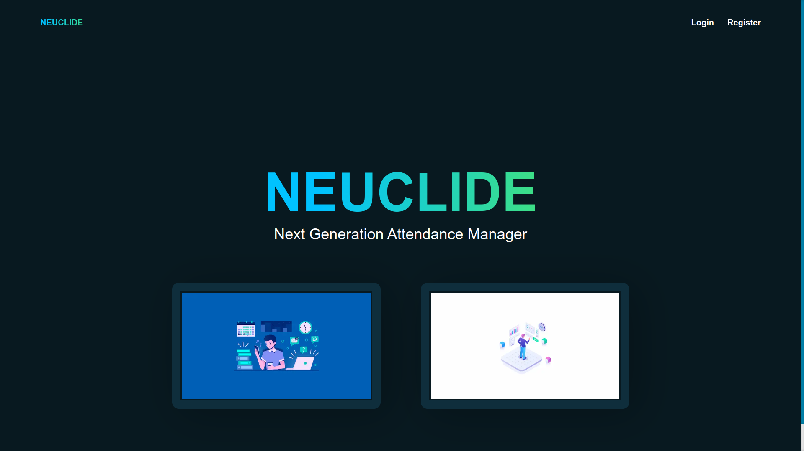
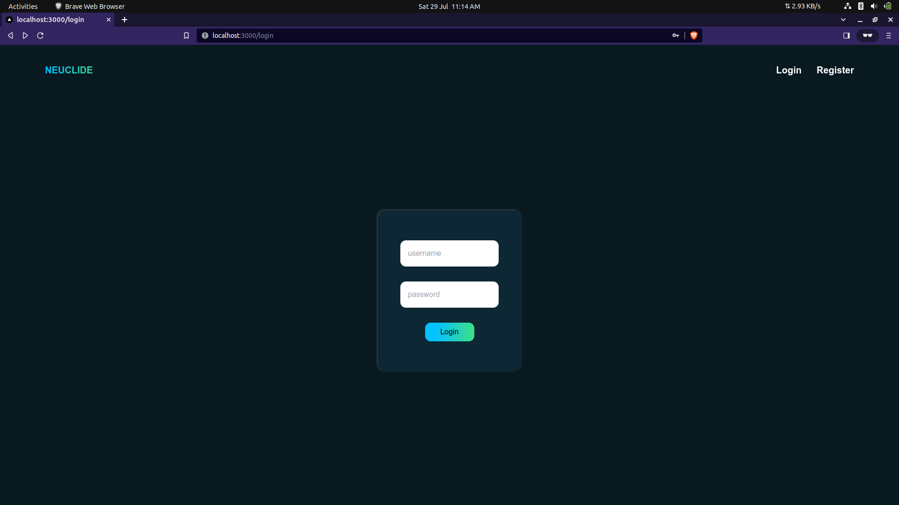
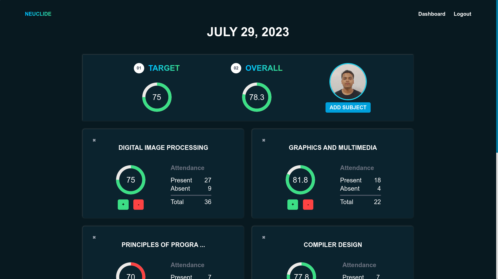
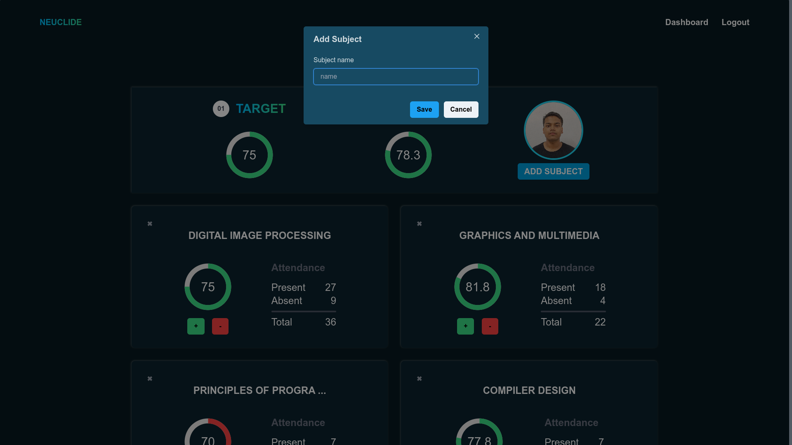
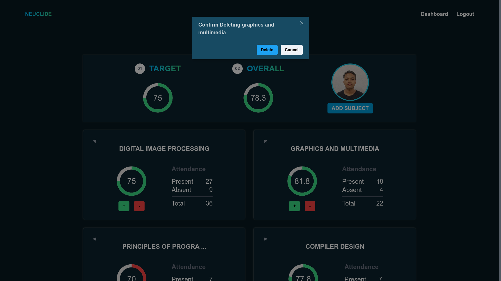

## Attendance Manager
---
### Technologies Used
- Nextjs
- Tailwind CSS
- Chakra UI
- Express
- Mongodb
- Mongoose
---
### Salient Features
- User Registration
- User Login/Logout
- View Attendance Dashboard
- Add/Delete Subject
- Mark Present/Absent
---
### Setup Locally

#### Database
- Create a new mongodb database named `neuclide`.
    - you can set other names also, then it needs to be updated in `.env` file also.

#### Server
- `cd ./server`
- install the dependencies
  - `yarn` 
  - copy `.env.example` to `.env` and fill the contents
    - `cp .env.example .env`
- run the server
  - `yarn devstart`

#### Client
- `cd ./client`
- install the required node modules 
  - `yarn`
- run it 
  - `yarn dev`

---

### Some Screenshots

